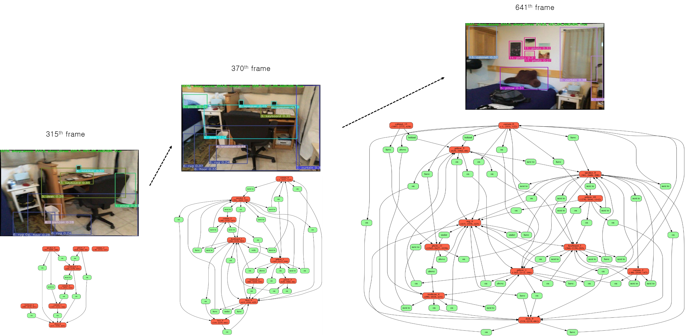

# 3D-Scene-Graph: *A Sparse and Semantic Representation of Physical Environments for Intelligent Agents*
This work is based on our paper (IEEE Transactions on Cybernetics 2019, under minor revision). we proposed a new concept called 3D scene graph and its construction framework. Our work is based on [FactorizableNet](https://github.com/yikang-li/FactorizableNet), implemented in Pytorch.

## 3D Scene Graph Construction Framework
The  proposed  3D  scene  graph  construction  framework  extracts  relevant  semantics  within  environments such  as  object categories  and  relations  between  objects  as  well  as  physical attributes 
such as 3D positions and major colors in the process of generating 3D scene graphs for the given environments. The framework receives a sequence of observations regarding the environments in the form of RGB-D image frames. 
For robust performance,  the  framework  filters  out  unstable  observations(i.e., blurry images) 
using the proposed adaptive blurry image detection algorithm. 
Then, the framework factors out keyframe groups  to  avoid  redundant  processing  of  the  same  information. 
Keyframe groups contain reasonably-overlapping frames. Next, the framework extracts semantics and physical attributes 
within the environments through recognition modules. 
During the  recognition  processes,  spurious  detections  get  rejected and  missing  entities  are  supplemented.  
Finally,  the  gathered information gets fused into 3D scene graph and the graph gets updated upon new observations.


## Requirements
* Ubuntu 16.04+
* Python 2.7
* [Pytorch 0.3.1](https://pytorch.org/get-started/previous-versions/) 
* [FactorizableNet](https://github.com/yikang-li/FactorizableNet)
* [ScanNet](http://www.scan-net.org) dataset (optional, used for test. an RGBD video from ScanNet is enough.)

## Installation

Install [Pytorch 0.3.1](https://pytorch.org/get-started/previous-versions/). The code has been tested only with Python 2.7, CUDA 9.0 on Ubuntu 16.04. 
You will need to modify a significant amount of code if you want to run in a different environment (Python 3+ or Pytorch 0.4+).


1. Download 3D-Scene-Graph repository 

```
git clone --recurse-submodules https://github.com/Uehwan/3D-Scene-Graph.git
```
2. Install FactorizableNet
```
cd 3D-Scene-Graph/FactorizableNet
```
Please follow the installation instructions in [FactorizableNet](https://github.com/yikang-li/FactorizableNet) repository.
Follow steps 1 through 6. You can skip step 7. Download VG-DR-Net in step 8. You do not need to download other models.

3. Install 3D-Scene-Graph
```
cd 3D-Scene-Graph
touch FactorizableNet/__init__.py
ln -s ./FactorizableNet/options/ options
mkdir data
ln -s ./FactorizableNet/data/svg data/svg
ln -s ./FactorizableNet/data/visual_genome data/visual_genome
   
pip install torchtext==0.2.3
pip install setuptools pyyaml graphviz webcolors pandas matplotlib 
pip install git+https://github.com/chickenbestlover/ColorHistogram.git
```

Alternatives: use installation script
```
   ./build.sh
```

4. Download [ScanNet](http://www.scan-net.org) dataset

In order to use ScanNet dataset, you need to fill out an agreement to toe ScanNet Terms of Use and send it to the ScanNet team at scannet@googlegroups.com.
If the process was successful, they will send you a script downloading ScanNet dataset.

To download a specific scan (e.g. `scene0000_00`) using the script (the script only runs on Python 2.7):
```
download-scannet.py -o [directory in which to download] --id scene0000_00
(then press Enter twice)
```
After the download is finished, the scan is located in a new folder `scene0000_00`.
In the folder, `*.sens` file contains the RGBD Video with camera pose. To extract them, we use SensReader, an extraction tool provided by ScanNet git repo.

```
git clone https://github.com/ScanNet/ScanNet.git
cd ScanNet/SensReader/python/
python reader.py --filename [your .sens filepath]  --output_path [ROOT of 3D-Scene-Graph]/data/scene0000_00/ --export_depth_images --export_color_images --export_poses --export_intrinsics
    
```


## Example of usage

```
python scene_graph_tuning.py --scannet_path data/scene0000_00/ --obj_thres 0.23 --thres_key 0.2 --thres_anchor 0.68 --visualize --frame_start 800 --plot_graph --disable_spurious --gain 10 --detect_cnt_thres 2 --triplet_thres 0.065
```

TODO: write examples of usage in detail

## Result



TODO: add more result figures, plots, and 3d scene graphs.


## Demo Video

[](https://youtu.be/DpW7eyF2HiI)

## Citations

Please consider citing this project in your publications if it helps your research. 
The following is a BibTeX reference. 

```
@article{kim2019graph3d,
  title={3D-Scene-Graph: A Sparse and Semantic Representation of Physical Environments for Intelligent Agents},
  author={Kim, Ue-Hwan and Park, Jin-Man and Song, Taek-Jin and Kim, Jong-Hwan},
  journal={IEEE Cybernetics, under minor revision},
  year={2019}
}
```

## Acknowledgement
This work was supported by the ICT R&D program
of MSIP/IITP. [2016-0-00563, Research on Adaptive Machine
Learning Technology Development for Intelligent Autonomous
Digital Companion]
